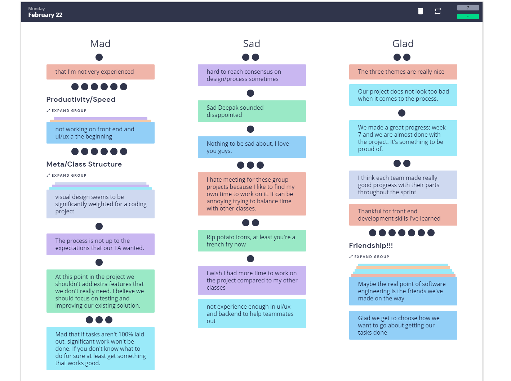
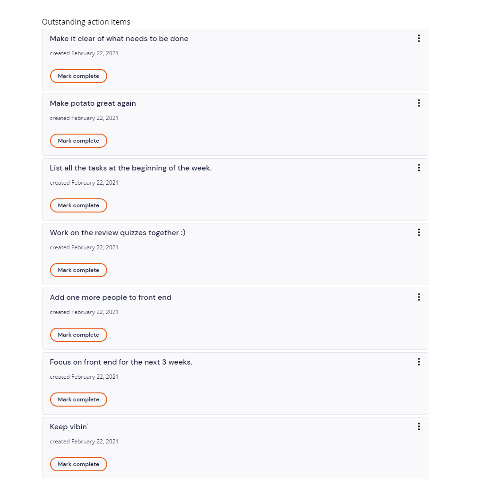

# Team 4
## Retrospective
## Tuesday, February 22, 2021

Meeting commenced at: 9:32 PM PST on Zoom and Retrium

Present:  
Alexis Chen  
Elizabeth Cho  
Kevin Jang  
Marco Kuan  
Ahmad Milad  
Rohan Patel  
Miaoqiu Sun  
Jessie Zou  

Absent:  

# Agenda
1. Retrospective: Think, Group, Vote, Discuss
2. Things to do by end of week 8 and 10.

# Notes
- Think: Had five minutes to put down what made us mad, sad, and glad about the project.
- Group: Jessie grouped together similar thoughts.
- Vote: Each member had five votes.

## Discuss
- Most of the votes were on the friendship among the team.
- Productivity should've been much faster. Add one more person to the frontend and make it a focus.
- Too much work in labs and review quizzes.
- Visual design seems like a lot for this type of class. There's a separate major for it.
- Mad that the task feature wasn't 100% laid out.
- Mad meeting for group projects because it's annoying balancing this with other classes.
- Hard to reach consensus on design and process.
- The three themes look really nice.
- Each team made good progress with their parts.
- The management process (assignments, GH Issues and Projects) were done great. 
  

Meeting adjourned at: 10:29 PM PST  
Time elapsed: 57 minutes
