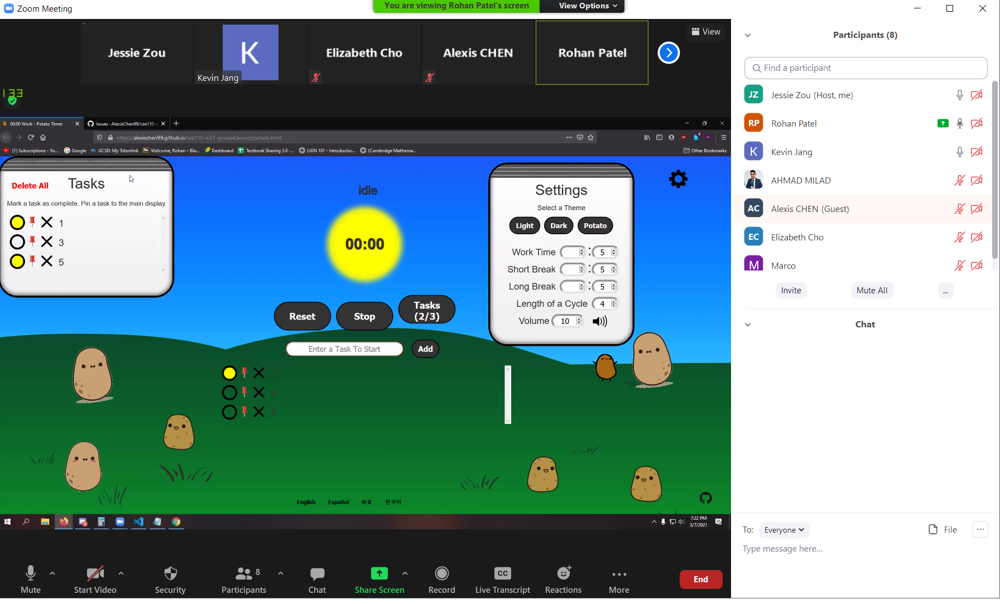

# Team 4
## Meeting Minutes
## Sunday, March 7, 2021

Meeting commenced at: 7:00 PM PST on Zoom

Present:  
Alexis Chen  
Elizabeth Cho  
Kevin Jang  
Marco Kuan  
Ahmad Milad  
Rohan Patel  
Miaoqiu Sun  
Jessie Zou  

Absent:  

# Agenda
1. Things to change and fix
2. Sprint Review

# Notes
- Remove the reset button and make the stop button inherit the reset functionality
  - Powell said that there should only be two buttons
- Fix the text being white in button elements and the reset button
- Confirmation prompt should be on top of everything
- Should have an end prompt to congratulate the user on marking all tasks as done
  - Stop should also tell how many pomos are done and how many tasks were completed
- Powell said that functionality is good, but things should be "pulled tighter" with the css and uniform styling
- Some Jest tests do not work, so the dev team should look at them and figure out how to satisfy the tests
- The potato theme is much more aesthetic where there are potatoes on the background. Potato animations now show up when a cycle of the timer is complete.
- Frontend: various fixes to things that the backend implemented. There are still many issues that need to be resolved from our weekly meetings with Deepak.
- More hands on mobile version
- Google Calendar should take the weekend to do, according to Deepak
  - Jessie is unsure if this can be implemented in time because it requires writing a script to log-in a user through Firebase.
- Move the add button within the enter task field
- Jessie: GC or Electron.js third-party implementation, Documentation
- Rohan and Marco: Congratulations prompt (endpoint of timer) 
- Ahmad, Shelly, Alexis: CSS (Mobile!!!)
- Elizabeth: QA (Jest, Cypress)
- Kevin: Acessibility, Instructions, Assist frontend and backend

## Sprint Review Summary

We thought that the first sprint retrospective was truly important to hold because it had allowed us to reflect upon how our first sprint went (Weeks 4-7). Many of us were mad and sad about the lack of frontend design we made during that period, so we started to communicate more across different subteams and coordinate what we have to do in weeks 8 and 9. Therefore, we were able to create a nicer potato theme and arranged the placement of buttons and other css styles. In addition, the task system was implemented in around three days after that retrospective. With stronger communication between us, we were able to get a lot of functionality done to the point that all we need to do is clean up CSS and write up finalized systems diagrams such as ADRs and a C4 model for the timer's behavior. There was a greater focus on accessibility and localization to the point that we have languages for English, Chinese, Spanish, and Korean. Most of the elements can be screen-read in a comprehensible form, so we can definitely perfect accessibility by the final presentation. In addition, we completed an edge case of what happens when someone doesn't have JS enabled because the timer won't work at all without it.

The most critical part we need to resolve is the CSS. The styling should be uniform in all the menus and the mobile version must be fixed. Because of this, we have around four people assigned to it. We are prioritizing making a clean CSS first before moving towards the media elements for mobile. 

Unit and E2E testing is coming gradually, but our QA is concerned that they may not achieve full coverage because there is a lot of DOM manipulation that can't necessarily be tested by Jest. Therefore many of the tests must be written in Cypress to handle all the theme css changes. There is active communication going on between the QA and backend that the rest of the tests will be written more efficiently. 

There are several things possible to complete in the remaining time we have. First we want to add an endpoint to the timer. Currently, the timer ends when all tasks are marked as done or if a pomodoro cycle is complete. When that happens, a congratulations screen should be shown to tell the user how many pomos they completed and probably how many tasks they were able to complete. In addition, the timer is initially confusing to start because a user must input a task. We would like to have an icon to open an instructions menu that clearly describes how a user should operate the timer. This would give the user a better experience and ensure that we will have returning customers. 

Meeting adjourned at: 7:56 PM PST  
Time elapsed: 56 minutes
