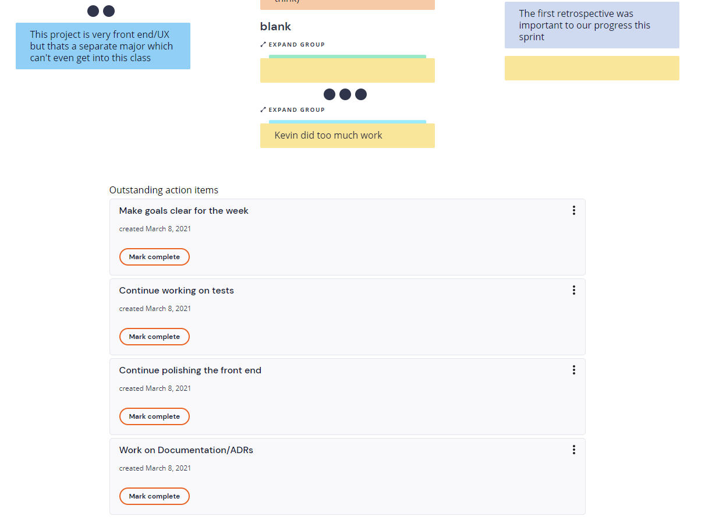

# Team 4
## Meeting Minutes
## Monday, March 8, 2021

Meeting commenced at: 9:23 PM PST on Zoom and Retrium

Present:  
Alexis Chen  
Elizabeth Cho  
Kevin Jang  
Marco Kuan  
Ahmad Milad  
Rohan Patel  
Miaoqiu Sun  
Jessie Zou  

Absent:  

# Agenda
1. 9:25 PM Create anonymous Mad, Sad, Glad notes
2. 9:32 PM Arrange and group the notes
3. 9:38 PM Review Points
4. 9:50 PM Action Plan

# Notes
- Conflicting opinions between Powell and Deepak 
- Productivity improved a lot 
- Deepak seems to like our timer
- Didn't get to add more features because of testing
- Review quizzes were tough
- The project was very frontend/UI when design is a separate major
- Many improvements since the last retro
- Team meetings are inconvenient
- Did not establish a clear goal or motivation at the beginning of our project
- We expect that everyone gets a B at minimum
- Work on Documentation, ADRs, frontend, tests

Meeting adjourned at: 10:03 PM PST  
Time elapsed: 40 minutes
