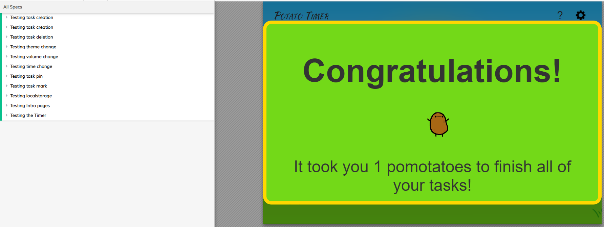
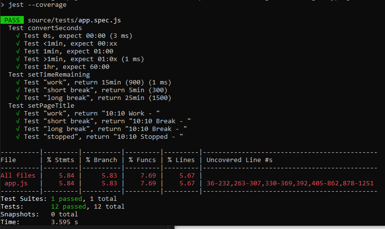

# QA/Testing Results
[app.js Cypress coverage report](../../coverage/lcov-report/app.js.html)  
  
[drag.js coverage report](../../coverage/lcov-report/drag.js.html)  
   

  
  

# Discussion
On app.js we have 93.68% statement coverage through Cypress and 5.84% statement coverage through Jest. That brings us to above 99% coverage of our primary Javascript file.

We have not extensively tested drag.js or lang.js. lang.js is simply a dict, and doesn't serve any direct functionality, so there is nothing to test. drag.js we did attempt to test but our coverage is relatively poor due to a known issue on Cypress's end. Testing dragging and dropping is apparently limited through Cypress, as shown in [this issue](https://github.com/cypress-io/cypress/issues/845). Also, we were able to test that drag and drop actually functions, just specifically not events triggered by the drag+drop.

As a result, we have almost full coverage of all the functionalities in our code. Detailed tests can be found in Jest [here](../../source/tests/app.spec.js) and Cypress [here](../../cypress/integration/e2e.spec.js).
